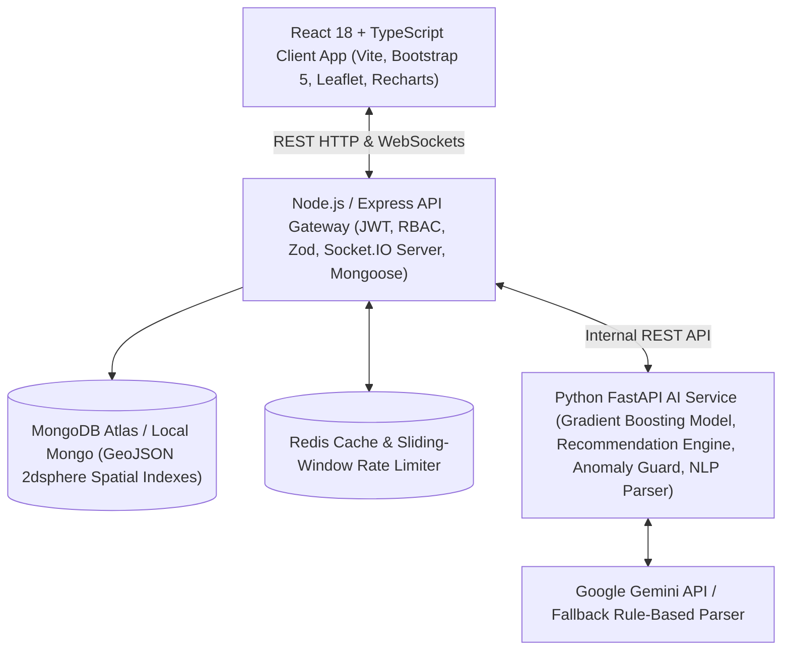

# AI-Powered Real Estate Intelligence & Property Recommendation Platform

A production-grade, multi-tier full-stack enterprise web platform engineered with **React 18 + TypeScript + Vite + Bootstrap 5**, **Node.js + Express + Mongoose + Socket.IO + Redis**, and **Python + FastAPI + XGBoost + Scikit-Learn + Gemini LLM Integration**.

The platform provides a complete real estate intelligence ecosystem featuring **Natural Language AI Search**, **Machine Learning Market Valuation (XGBoost)**, **Hybrid Personalization & Explainable Recommendation Engines**, **Automated Listing Fraud / Anomaly Detection**, **Geospatial Location Filtering**, **Real-Time Buyer-Agent WebSocket Chat**, **Interactive Analytics Dashboards**, and **Docker / GitHub Actions CI/CD Containerization**.

---

## 📋 Table of Contents
1. [System Architecture](#-system-architecture)
2. [Role-Based Access Control (RBAC)](#-role-based-access-control-rbac)
3. [Core Feature Breakdown](#-core-feature-breakdown)
4. [AI / ML & NLP Pipeline Specifications](#-ai--ml--nlp-pipeline-specifications)
   - [1. XGBoost Property Price Valuation Engine](#1-xgboost-property-price-valuation-engine)
   - [2. Hybrid Recommendation System & Explainable Rationale](#2-hybrid-recommendation-system--explainable-rationale)
   - [3. Automated Listing Fraud & Anomaly Guard](#3-automated-listing-fraud--anomaly-guard)
   - [4. Natural-Language AI Search Parser](#4-natural-language-ai-search-parser)
5. [Complete REST API Reference](#-complete-rest-api-reference)
6. [Real-Time Socket.IO WebSocket Protocol](#-real-time-socketio-websocket-protocol)
7. [Database Schema & Indexing](#-database-schema--indexing)
8. [Pre-seeded Demo Accounts](#-pre-seeded-demo-accounts)
9. [Quick Start & Docker Deployment](#-quick-start--docker-deployment)
10. [Automated Testing Suite](#-automated-testing-suite)
11. [CI/CD & Production Deployment](#-cicd--production-deployment)

---

## 🏛️ System Architecture

The platform operates on a decoupled multi-tier microservice architecture:



### Key Technical Specs
- **Frontend**: React 18, TypeScript, Vite, Bootstrap 5, Leaflet Maps (`react-leaflet`), Recharts, TanStack Query (React Query), Socket.IO Client, Lucide Icons.
- **Backend API**: Node.js, Express.js, TypeScript, Mongoose, Socket.IO, Zod Schema Validation, JWT Authentication, bcrypt password hashing, Helmet, Rate Limiter.
- **Database**: MongoDB with GeoJSON `2dsphere` spatial indexing on `[longitude, latitude]` for fast spatial queries (`$near`, `$maxDistance`).
- **Caching**: Redis caching for query optimization with automatic key invalidation on property mutation.
- **AI/ML Service**: Python 3.11/3.14, FastAPI, Pandas, NumPy, Scikit-learn, XGBoost / GradientBoostingRegressor, Joblib model serialization, Pytest.
- **DevOps**: Docker, `docker-compose.yml`, multi-stage Dockerfiles, Nginx reverse proxy, GitHub Actions CI/CD workflows.

---

## 🔐 Role-Based Access Control (RBAC)

The application enforces strict Role-Based Access Control across three primary roles:

| Feature / Action | BUYER | AGENT | ADMIN |
|---|:---:|:---:|:---:|
| Browse & Search Listings | ✅ | ✅ | ✅ |
| Natural Language AI Search | ✅ | ✅ | ✅ |
| Interactive Leaflet Map Search | ✅ | ✅ | ✅ |
| View AI Price Valuations | ✅ | ✅ | ✅ |
| Compare Properties Side-by-Side | ✅ | ✅ | ✅ |
| Save Favorite Properties | ✅ | ❌ | ❌ |
| Contact Listing Agent / Send Inquiry | ✅ | ❌ | ❌ |
| Schedule Site Visit Appointments | ✅ | ❌ | ❌ |
| Real-time Socket.IO Buyer-Agent Chat | ✅ | ✅ | ❌ |
| AI Property Advisor Assistant | ✅ | ✅ | ✅ |
| Create / Edit / Delete Own Listings | ❌ | ✅ | ✅ |
| View Agent Listing Performance Analytics | ❌ | ✅ | ✅ |
| View Suspicious Listing Warnings | ❌ | ✅ | ✅ |
| Approve / Reject Pending Listings | 开启 | ❌ | ✅ |
| Review Flagged Fraud Listings & Suspend | ❌ | ❌ | ✅ |
| Verify Agent Credentials & Manage Users | ❌ | ❌ | ✅ |
| Platform-wide Governance Analytics | ❌ | ❌ | ✅ |

---

## ⚡ Core Feature Breakdown

### 1. Advanced Property Search & Map Engine
- **Multi-Filter Queries**: Filter by City, Locality, Property Type (`Apartment`, `Villa`, `Independent House`, `Plot`, `Commercial`), Min/Max Price, Bedrooms (BHK), Bathrooms, Min/Max Area (sq.ft), Furnished Status, Construction Status, Parking, and Amenities.
- **Geospatial Spatial Search**: Interactive Leaflet map with property pins, popups, and radius circle overlays (e.g. *"Show properties within 5 km"*).
- **MongoDB 2dsphere Indexing**: High-performance spatial indexing using `location: { type: 'Point', coordinates: [lng, lat] }`.
- **Search Result Caching**: Redis caches frequent search parameter combinations with invalidation triggers when new properties are listed.

### 2. Natural Language AI Search Engine
- Users type unstructured natural language prompts, such as:
  > *"I need a 3BHK apartment near OMR under 80 lakhs with parking and good access to schools."*
- **Execution Pipeline**:
  `React UI` → `Express API` → `FastAPI AI Service` → `Gemini API / NLP Parser` → `Validated JSON Parameters` → `MongoDB Search Service` → `Results`
- **Extracted Structured JSON Example**:
  ```json
  {
    "city": "Chennai",
    "locality": "OMR",
    "propertyType": "Apartment",
    "bedrooms": 3,
    "maxPrice": 8000000,
    "parking": true
  }
  ```
- **Security Rule**: The LLM *never* directly queries the database. It only generates structured JSON search parameters, which are validated by Zod before executing against MongoDB.

### 3. Property Comparison Matrix
- Compare **2 to 4 properties** side-by-side.
- Metrics matrix comparison: Price, Price per Sq.Ft, Area, BHK, Bathrooms, Locality, Property Type, Age, Furnishing, Parking, Amenities, and Verification Status.
- Includes an **AI Property Comparison Summary** highlighting key price-to-area value trade-offs.

### 4. Direct Real-Time Buyer-Agent Chat
- Built with **Socket.IO** WebSockets.
- Direct message exchange, real-time delivery, online/offline presence indicators, typing indicators, unread message badges, and persistent database chat history in MongoDB.

### 5. Inquiry & Visit Appointment Booking System
- **Inquiry Flow**: Buyers submit property inquiries -> Instant WebSocket notification dispatched to listing agent -> Agent manages inquiries queue (Status: `PENDING`, `CONTACTED`, `RESOLVED`).
- **Appointment Visit Flow**: Buyers select date and time slot -> System checks for overlapping agent bookings -> Appointment created -> Notifications dispatched.

### 6. Agent Workspace & Performance Analytics
- Property listing CRUD with automated image URL preview validation.
- Interactive **Recharts analytics** displaying views, favorites, inquiries, conversion rates, and price performance trends.
- Automatic warnings for suspicious listing flags.

### 7. Admin Governance Portal
- Listing review queue for pending approvals.
- Anomaly & Fraud Risk inspector displaying individual risk scores (0–100) and specific risk reasons (e.g. *"Price 65% below local average rate"*).
- One-click **Approve**, **Reject**, or **Suspend Listing** controls.
- User management table with Agent Verification status controls.

---

## 🤖 AI / ML & NLP Pipeline Specifications

### 1. XGBoost Property Price Valuation Engine
- **Objective**: Predict fair market property valuation with upper and lower confidence intervals.
- **Model**: `GradientBoostingRegressor` / `XGBoost` trained on synthetic real estate datasets across major metropolitan areas (Chennai, Bangalore, Mumbai, Delhi, Hyderabad).
- **Features Used**: `city`, `locality`, `propertyType`, `bedrooms`, `bathrooms`, `area`, `propertyAge`, `floor`, `amenities_count`, `parking`.
- **Model Performance Metrics**:
  - **MAE (Mean Absolute Error)**: ₹15,39,922
  - **R² Score**: **0.9869 (98.69% Variance Explained)**
- **Response Format**:
  ```json
  {
    "predicted_price": 7850000.0,
    "lower_bound": 7300000.0,
    "upper_bound": 8400000.0,
    "confidence_interval": "95%"
  }
  ```

### 2. Hybrid Recommendation System & Explainable Rationale
- **Pipeline**: User Interactions (Views, Favorites, Comparisons, Inquiries) → Feature Vector Construction → Candidate Retrieval → Hybrid Ranking → Top Recommendations with Explainable Reasons.
- **Explainable Rationale Generation**:
  - *"Within your preferred budget threshold"*
  - *"Matches your preferred 3BHK configuration"*
  - *"Located in your target locality (OMR)"*
  - *"Similar to properties you previously viewed"*

### 3. Automated Listing Fraud & Anomaly Guard
Calculates `fraudRiskScore` (0–100) based on statistical anomaly heuristics:
- **Rule 1**: Price per sq.ft significantly lower than local market mean rate (+45 Risk Points).
- **Rule 2**: Missing verification images (+25 Risk Points).
- **Rule 3**: Extremely brief or generic description (+15 Risk Points).
- **Rule 4**: Suspicious urgency phrases like *"urgent cash transfer, no paperwork"* (+20 Risk Points).
- **Rule 5**: Abnormally high listing creation rate from single agent (+15 Risk Points).

### 4. Natural-Language AI Search Parser
Uses Google Gemini API with a robust fallback regex NER parser when offline or without API keys, extracting parameters with high confidence.

---

## 📡 Complete REST API Reference

### Authentication Routes (`/api/auth`)
| Method | Endpoint | Description | Auth Required |
|---|---|---|---|
| `POST` | `/api/auth/register` | Register Buyer or Agent account | Public |
| `POST` | `/api/auth/login` | Login & receive JWT token | Public |
| `POST` | `/api/auth/logout` | Invalidate session | Authenticated |
| `GET` | `/api/auth/me` | Fetch authenticated user profile | Authenticated |
| `PUT` | `/api/auth/profile` | Update profile details | Authenticated |

### Property Routes (`/api/properties`)
| Method | Endpoint | Description | Auth Required |
|---|---|---|---|
| `GET` | `/api/properties` | Search, filter, paginate & geospatial query | Public |
| `GET` | `/api/properties/:id` | Get property detail & increment views | Public |
| `POST` | `/api/properties` | Create new listing (runs fraud check) | Agent / Admin |
| `PUT` | `/api/properties/:id` | Update listing specs | Agent / Admin |
| `DELETE` | `/api/properties/:id` | Delete property listing | Agent / Admin |
| `POST` | `/api/properties/compare` | Retrieve side-by-side compare dataset | Public |

### Favorites Routes (`/api/favorites`)
| Method | Endpoint | Description | Auth Required |
|---|---|---|---|
| `GET` | `/api/favorites` | Get user saved favorite properties | Authenticated |
| `POST` | `/api/favorites/:propertyId` | Add property to favorites | Authenticated |
| `DELETE` | `/api/favorites/:propertyId` | Remove property from favorites | Authenticated |

### Inquiry & Appointment Routes
| Method | Endpoint | Description | Auth Required |
|---|---|---|---|
| `GET` | `/api/inquiries` | List buyer or agent inquiries | Authenticated |
| `POST` | `/api/inquiries` | Send inquiry to listing agent | Authenticated |
| `PUT` | `/api/inquiries/:id` | Update inquiry status | Agent / Admin |
| `GET` | `/api/appointments` | List scheduled visits | Authenticated |
| `POST` | `/api/appointments` | Schedule visit (slot overlap check) | Authenticated |
| `PUT` | `/api/appointments/:id` | Update visit status | Authenticated |

### AI & Machine Learning Routes (`/api/ai`)
| Method | Endpoint | Description | Auth Required |
|---|---|---|---|
| `POST` | `/api/ai/search` | Parse natural language prompt & execute search | Public |
| `POST` | `/api/ai/predict-price` | Run XGBoost price valuation model | Public |
| `POST` | `/api/ai/fraud-check` | Run listing anomaly detection check | Public |
| `GET` | `/api/ai/recommendations` | Get hybrid recommendations + reasons | Public |
| `POST` | `/api/ai/chat` | Grounded AI property chatbot assistant | Public |

### Analytics & Admin Routes
| Method | Endpoint | Description | Auth Required |
|---|---|---|---|
| `GET` | `/api/analytics/agent` | Agent performance KPIs & price trends | Agent / Admin |
| `GET` | `/api/analytics/admin` | Platform health & governance metrics | Admin |
| `GET` | `/api/admin/properties/pending` | Get listings awaiting verification | Admin |
| `GET` | `/api/admin/properties/suspicious`| Get listings flagged with fraud risk | Admin |
| `PUT` | `/api/admin/properties/:id/approve`| Approve listing for search results | Admin |
| `PUT` | `/api/admin/properties/:id/reject` | Reject listing | Admin |
| `PUT` | `/api/admin/properties/:id/suspend` | Suspend listing due to fraud risk | Admin |
| `GET` | `/api/admin/users` | Manage registered buyers and agents | Admin |
| `PUT` | `/api/admin/users/:id/verify` | Verify agent credentials | Admin |

---

## ⚡ Real-Time Socket.IO WebSocket Protocol

| Event Name | Direction | Payload | Description |
|---|---|---|---|
| `send_message` | Client → Server | `{ receiverId, propertyId, content }` | Send real-time chat message |
| `receive_message` | Server → Client | `{ _id, senderId, content, createdAt }` | Deliver message to recipient |
| `typing_start` | Client → Server | `{ receiverId }` | Broadcast typing indicator |
| `typing_stop` | Client → Server | `{ receiverId }` | Stop typing indicator |
| `user_status_changed` | Server → Client | `{ userId, status: 'online'/'offline' }` | Live presence updates |
| `new_inquiry` | Server → Client | `{ inquiryId, propertyTitle, buyerName }` | Alert agent of new inquiry |
| `new_appointment` | Server → Client | `{ appointmentId, propertyTitle, date }` | Alert agent of new visit booking |
| `suspicious_listing_alert`| Server → Client | `{ propertyId, title, fraudRiskScore }` | Alert admins of fraud flag |

---

## 🗄️ Database Schema & Indexing

### Mongoose Models Summary
- **User**: `name`, `email`, `password` (select: false), `role` (`BUYER`, `AGENT`, `ADMIN`), `phone`, `agencyName`, `avatar`, `isVerified`.
- **Property**: `title`, `description`, `propertyType`, `listingType`, `price`, `pricePerSqFt`, `bedrooms`, `bathrooms`, `area`, `floor`, `propertyAge`, `furnishedStatus`, `amenities`, `parking`, `address`, `city`, `locality`, `location` (`GeoJSON Point`), `images`, `agentId`, `verificationStatus`, `fraudRiskScore`, `views`, `favoritesCount`.
- **Interaction**: `userId`, `propertyId`, `interactionType` (`VIEW`, `FAVORITE`, `COMPARE`, `INQUIRY`, `APPOINTMENT`, `SEARCH`), `dwellTimeSeconds`.
- **Inquiry**: `propertyId`, `buyerId`, `agentId`, `name`, `email`, `phone`, `message`, `status`.
- **Appointment**: `propertyId`, `buyerId`, `agentId`, `date`, `timeSlot`, `status`.
- **Message**: `senderId`, `receiverId`, `propertyId`, `content`, `read`.

### Database Indexes
- `PropertySchema.index({ location: '2dsphere' })` - Enables `$near` geospatial radius search.
- `PropertySchema.index({ title: 'text', description: 'text', locality: 'text', city: 'text' })` - Enables text search.
- `FavoriteSchema.index({ userId: 1, propertyId: 1 }, { unique: true })` - Prevents duplicate favorites.

---

## 👥 Pre-seeded Demo Accounts

When the backend starts up, it automatically seeds initial demo accounts and luxury listings:

| Role | Email | Password | Pre-configured Data |
|---|---|---|---|
| **BUYER** | `buyer@estateintel.com` | `Password123!` | Active buyer profile |
| **AGENT** | `agent@estateintel.com` | `Password123!` | Apex Realty Solutions agent with 4 seeded properties |
| **ADMIN** | `admin@estateintel.com` | `Password123!` | System administrator with full governance access |

---

## 🚀 Quick Start & Docker Deployment

### Prerequisites
- **Node.js**: v20+ or v24+
- **Python**: v3.11+
- **MongoDB**: Local MongoDB or MongoDB Atlas URI
- **Docker**: Docker Desktop (for containerized execution)

---

### Method 1: Multi-Container Docker Compose Execution (Recommended)

1. Clone the repository and configure environment variables:
   ```bash
   cp .env.example .env
   ```

2. Spin up the entire multi-container stack:
   ```bash
   docker-compose up --build
   ```

3. Access platform endpoints:
   - **React Frontend**: [http://localhost:5173](http://localhost:5173)
   - **Express API Gateway**: [http://localhost:5000/api/health](http://localhost:5000/api/health)
   - **Python FastAPI AI Service**: [http://localhost:8000/docs](http://localhost:8000/docs)

---

### Method 2: Manual Standalone Local Setup

#### Step 1: Start Python AI Microservice
```bash
cd ai-service
python -m venv venv
# On Windows: venv\Scripts\activate | On Mac/Linux: source venv/bin/activate
pip install -r requirements.txt
python train_model.py
uvicorn app.main:app --reload --port 8000
```

#### Step 2: Start Express Backend API Gateway
```bash
cd server
npm install
npm run dev
```

#### Step 3: Start React Frontend Application
```bash
cd client
npm install
npm run dev
```

---

## 🧪 Automated Testing Suite

The codebase features comprehensive unit, integration, and ML validation test suites across all tiers:

```bash
# 1. Run Python AI Pytest Suite (ML model & endpoint tests)
cd ai-service
pytest

# 2. Run Backend Express Jest Integration Tests (API & Auth tests)
cd server
npm test

# 3. Run React Vitest Component Tests
cd client
npm test
```

---

## 📦 CI/CD & Production Deployment

### GitHub Actions CI/CD (`.github/workflows/ci.yml`)
Runs on every push to `main` or pull request:
1. Installs Node.js & Python dependencies.
2. Executes Python `pytest` ML regression validation suite.
3. Executes Express Jest API integration test suite.
4. Executes React `vitest` UI component test suite.
5. Builds production bundles and multi-stage Docker images (`Dockerfile.client`, `Dockerfile.server`, `Dockerfile.ai`).

---

## 📄 License
MIT License. Created for Production Full-Stack AI Architecture Portfolio.
